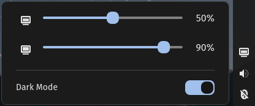

# External Monitor Brightness Applet for the COSMIC™ desktop

Change brightness of external monitors via DDC/CI protocol. You can also quickly toggle system dark mode.

## Setup

For this to work you need write access to `/dev/i2c-*`.
See [https://www.ddcutil.com/i2c_permissions/](https://www.ddcutil.com/i2c_permissions/).
